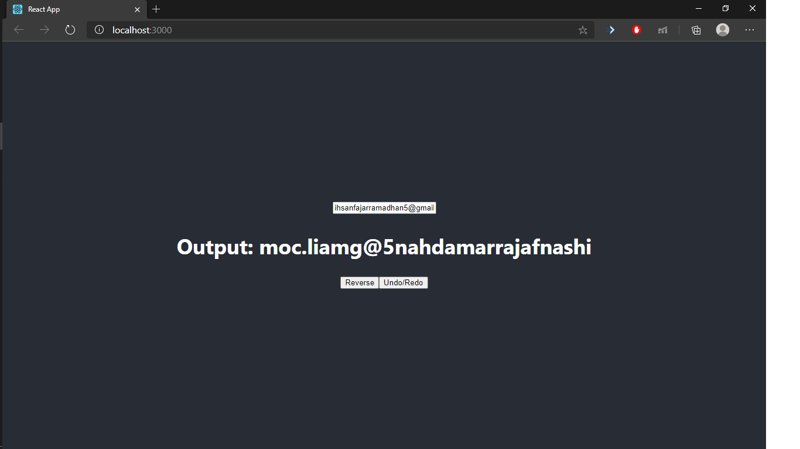
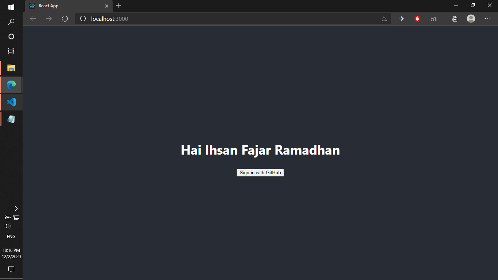

# Laporan RFCI-FE

## Sorting

Terdapat pada file `./sort.js`.
Program sorting menggunakan satu buah while-loop dan satu buah for-loop. While-loop berfungsi untuk memastikan bahwa angka dalam deret sudah tersortir. Selama ada angka dalam deret yang di-swap atau di tukar, maka while-loop akan terus berjalan. Dalam for-loop, apabila ada angka yang di-swap atau ditukar, maka akan menentukan nilai swapped = true. Angka yang ditukar akan disimpan dalam variabel swap dalam bentuk array. Setiap ada angka yang ditukar maka akan melakukan console.log dengan isi angka yang ditukar dan hasil penukarannya. Jumlah angka yang ditukar juga dihitung setiap ada penukaran.

input:

    4 9 7 5 8 9 3

output:

    [7,9] -> 4 7 9 5 8 9 3
    [5,9] -> 4 7 5 9 8 9 3
    [5,7] -> 4 5 7 9 8 9 3
    [8,9] -> 4 5 7 8 9 9 3
    [3,9] -> 4 5 7 8 9 3 9
    [3,9] -> 4 5 7 8 3 9 9
    [3,8] -> 4 5 7 3 8 9 9
    [3,7] -> 4 5 3 7 8 9 9
    [3,5] -> 4 3 5 7 8 9 9
    [3,4] -> 3 4 5 7 8 9 9
    Jumlah swap=10

## Simple mobile App

Terdapat pada folder `./simple-mobile-app`
Simple mobile App dibuat dengan React Js. Dalam App.js saya membuat tiga buah state yaitu

    const [input, setInput]=useState("");
    const [output, setOutput]=useState("");
    const [reversed, setReversed]=useState(false);
    const [undo, setUndo]=useState(false);

State `input` berfungsi untuk merekam perubahan pada elemen `<input>`. State `output` berfungsi untuk merekam isi yang akan ditampilkan pada label `<h2>`. State `reversed` berfungsi untuk merekam kondisi output apakah terbali atau tidak. State `undo` berfungsi untuk merekam apabia fungsi undo dijalankan, untuk mencegah fungsi `redo` berjaan apabila tidak ada aksi `undo` sebelumnya.

Saya juga membuat empat buah helper function yaitu:

    const handleChange=(e)=>{
        setInput(e.target.value);
        setOutput(e.target.value);
    }
    const handleReverse=()=>{
        input && setOutput(input.split("").reverse().join(""));
        setReversed(true)
    }
    const handleUndo=()=>{
        reversed && setOutput(output.split("").reverse().join(""));
        reversed && setUndo(true);
        reversed && setReversed(false);
    }
    const handleRedo=()=>{
        undo && setOutput(output.split("").reverse().join(""));
        undo && setReversed(!reversed);
        undo && setUndo(!undo);
    }

Hasil akhir:

Fungsi `handleChange` dijalankan apabila ada event `onChange` dari `<input>` text, berfungsi untuk merekam perubahan dan menyimpan pada state `input`. Fungsi `handleReverse` dijalankan pada `<button>` `Reverse`, berfungsi untuk membalik nilai state `input` dan menyimpannya dalam state `output` untuk ditampilkan di elemen `<h2>`. Fungsi `handleUndo` dijalankan pada `<button>` `Undo/Redo` apabila di klik 1x, berfungsi untuk membalik nilai state `output` kembali ke nilai semula. Terakhir fungsi `handleRedo` dijalankan pada `<button>` `Undo/Redo` apabila di klik 2x, berfungsi untuk membalik hasil dari fungsi `handleUndo` dengan catatan tidak menggantikan fungsi tombol `Reverse`. 

Sedangkan tampilan web yang direturn adalah sebagai berikut:

    

        <header className="App-header">
            <input type="text" onChange={e=>handleChange(e)} />
            <h2>
            {`Output: ${output}`}
            </h2>
            

            <button onClick={handleReverse}>Reverse</button>
            <button onClick={handleUndo} onDoubleClick={handleRedo}>Undo/Redo</button>
            

        </header>
    

## Simple App Debugging

Terdapat pada folder `./simple-app-debugging`
Terdapat 6 buah bug yang saya temukan yang menyebabkan hasil tidak seperti yang diharapkan

### 1. Dalam `App.js` kekurangan clientId, clientSecret, redirectUri
Pada github, saya membuat aplikasi baru untuk mendapatkan clientId dan clientSecret, juga untuk mengatur redirectUri-nya ke `http://localhost:3000/`.

### 2. Pada baris ke 17 dalam `utils.js`

Dari:

    let query = `${str}${key}==${params[key]}`;

Analisis error: kelebihan `=`

Perbaikan menjadi:

    let query = `${str}${key}=${params[key]}`;

### 3. Pada fungsi `onSuccess` dalam `GithubLogin.js`

Dari:

    this.onGetAccessToken(data);

Analisis error: variabel `data` bertipe objek, sedangkan argumen yang diharapkan oleh `this.onGetAccessToken()` adalah variabel bertipe string.

Perbaikan menjadi:

    this.onGetAccessToken(data.code);

Argumen yang dimasukkan direferensikan pada isi objek `data` dengan nama `code`.

### 4. Permasalahan `CORS` dari github yang tidak menerima request dari `http://localhost:3000`
solusi: menggunakan `https://cors-anywhere.herokuapp.com/`

### 5. Pada fungsi `onGetAccessToken` dalam `GithubLogin.js`

Dari:

    .then((access_token) => {
        this.onGetProfile(access_token);

Analisis error: variabel `access_token` dalam `then((access_token) =>` menetapkan keseluruhan respons berupa objek dari axios post request ke variabel `access_token`. Solusinya adalah mengubah variabel tersebut ke `response` atau sesuai keinginan lalu mereferensikan key `response.data.access_token` ke `this.onGetProfile()`.

menjadi

    .then((response) => {
        this.onGetProfile(response.data.access_token);

### 6. Pada fungsi `onGetProfile` dalam `GithubLogin.js`

Dari:

    .then((response) => {
      this.props.onSuccess(response.data);

Analisis error: variabel `response.data` bertipe objek sedangakan argumen yang diharapkan oeh `this.props.onSuccess` adalah string. Solusinya referensikan pada referensi key `nama` sesuai dengan kriteria hasil yang diharapkan.

Menjadi:

    .then((response) => {
      this.props.onSuccess(response.data.name);

Agar nama keluar diperlukan waktu selama beberapa saat untuk menunggu requests selesai.

